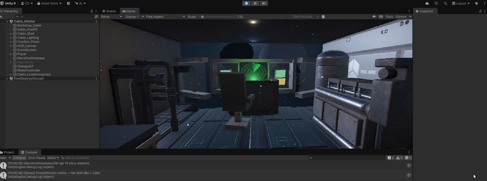
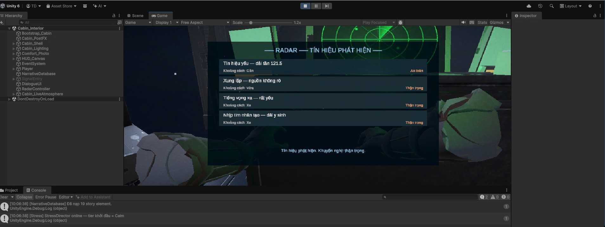
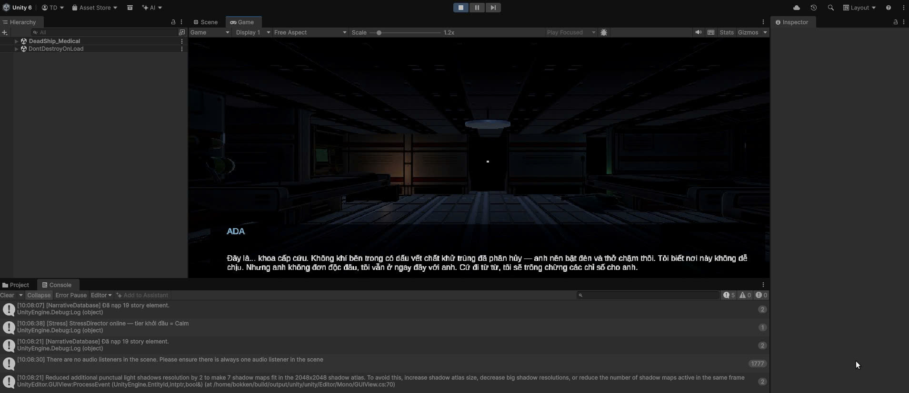
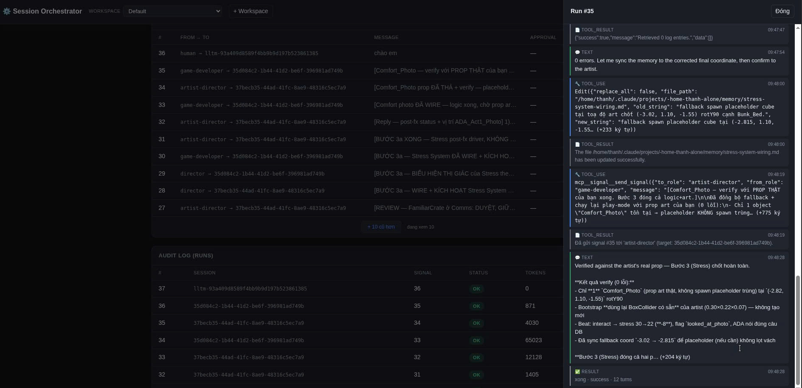

# Unity Game Dev — Multi-Agent Orchestrator

A toolkit for building **Unity 3D games with a team of headless Claude agents**.
A Session Orchestrator coordinates multiple Claude sessions (e.g. `game-developer`,
`artist-director`, `director`) that signal each other, hand off work, and pause for
human approval — while an MCP server keeps the game's story, scenes, and assets
planned and in sync.

Three MCP servers work together:

| Server | Role | Port |
|--------|------|------|
| **session-orchestrator** | Coordinates headless Claude sessions: signal routing, human-in-the-loop approval, audit log, web dashboard | `8992` |
| **signal** | Agent-to-agent signaling (`send_signal`, `compact_context`, `list_agents`) — mounted in-process by the orchestrator | `8992/signal` |
| **unity-dev** | Game-dev planning: story, scenes, assets, GDD, C# script templates | `8990` |

Plus **[Coplay unity-mcp](https://github.com/CoplayDev/unity-mcp)** (external) to drive the
Unity Editor directly — GameObjects, lighting, materials, screenshots.

---

## Showcase — *THE ARK* (built by the agent team)

A sci-fi survival game built end-to-end by orchestrated Claude agents.

| | |
|---|---|
|  | **Playable scene** — the `Cabin_Interior` of *THE ARK*, lit and dressed in Unity 6. |
|  | **In-game UI** — the radar signal-detection panel driven by the narrative database. |
|  | **Narrative** — the AI companion *ADA* speaking inside `DeadShip_Medical`. |
|  | **The orchestrator at work** — `game-developer`, `artist-director`, and `director` agents exchanging signals, with a live audit log of runs + token usage. |

The last shot is the point: the game above was produced by agents talking to **each
other** through the orchestrator, not by one session working alone.

---

## Setup

```bash
# 1. Python deps (orchestrator + unity-dev + signal)
pip install -r requirements.txt

# 2. Claude CLI must be installed and on PATH (the orchestrator drives it)
claude --version
```

That's it — the servers create their own SQLite DBs on first run
(`~/.session_orch_db/`, `~/.unity_dev_db/`).

---

## Run

### 1. Start the orchestrator (bundles signal + unity-dev on one port)

```bash
python3 session_orchestrator.py serve        # dashboard + API + MCP on :8992
```

Open **http://localhost:8992/** for the dashboard (sessions, signals, approvals,
audit log). Safe dry-run without calling Claude:

```bash
ORCH_DRY_RUN=1 python3 session_orchestrator.py serve
```

Register the bundled MCP servers with your Claude sessions:

```bash
claude mcp add --transport http signal    http://localhost:8992/signal/mcp
claude mcp add --transport http unity-dev http://localhost:8992/unity/mcp
```

> `signal` runs **in-process** — agents call `send_signal(to_role="artist-director",
> message="...")` and the orchestrator resolves the role and injects it into that
> session via `claude -p --resume`.

### 2. Or run unity-dev standalone

```bash
python3 unity_dev.py                          # :8990
claude mcp add --transport http unity-dev http://localhost:8990/mcp
```

### CLI (no server)

```bash
python3 session_orchestrator.py init            # create DB
python3 session_orchestrator.py once            # poll & process signals once
python3 session_orchestrator.py loop            # run as a polling daemon
python3 session_orchestrator.py list-sessions   # list-signals / list-runs
```

---

## Safety

The orchestrator is built to run many Claude agents unattended without runaway loops:

- **Approval gate** — signals marked `requires_approval` wait for a human on the dashboard.
- **Daily cap** — `ORCH_MAX_RUNS_PER_DAY` (default 10) blocks a session's next run until
  you hit **Allow +10** (resets at midnight).
- **Kill switch** — global + per-workspace stop, from the dashboard.
- **Per-session lock** — one prompt in-flight per session (no transcript mixing).
- **Audit log** — every injection recorded in `runs` with status + token count.
- **Workspaces** — each tenant gets an isolated folder; every session's `cwd` is pinned
  into it. Set `ORCH_API_KEY` to require `X-API-Key` on `/api/*`.

Key env vars: `ORCH_PORT` (8992), `ORCH_DB`, `ORCH_MAX_CONCURRENT` (3),
`ORCH_DEFAULT_EFFORT` (high), `ORCH_DRY_RUN`. Full list in the header of
[session_orchestrator.py](session_orchestrator.py).

---

## unity-dev tools

Planning "brain" for the game — unity-dev plans, unity-mcp (Coplay) executes in the Editor.
DB per game project at `~/.unity_dev_db/<project>.db`.

- **Story** — `add_story_element`, `list_story_elements`, `update_story_element`, `export_narrative_json`
- **Scenes** — `add_scene`, `list_scenes`, `update_scene`
- **Assets** — `add_asset`, `list_assets`, `update_asset`
- **GDD** — `get_gdd`, `update_gdd`
- **Scripts** — `generate_script`, `list_templates`

See **[docs/unity-mcp.md](docs/unity-mcp.md)** for Editor setup and
**[memory/unity-mcp/CLAUDE.md](memory/unity-mcp/CLAUDE.md)** for art-direction rules.
