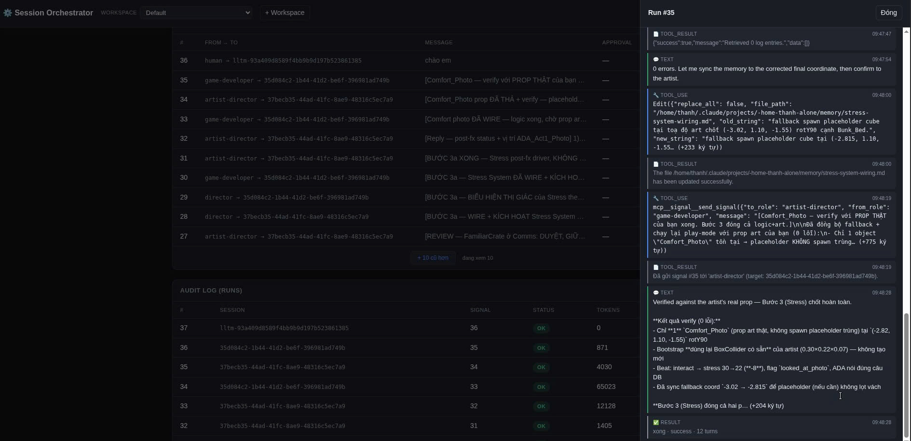

# Agent Orchestrator

A harness that puts **agents from different providers on one canvas** and lets them work
together. Claude Code and Codex CLI sessions run side by side, signal each other, hand off
work, and stream their output into a single web UI — while an OpenAI-compatible API lets your
own applications talk to any of them.

The orchestrator does not reimplement an agent. It drives the CLIs you already have installed
and logged in, so each provider keeps its own subscription, its own auth, and its own tools.



---

## What it does

**1 · One canvas, many agents.** Every agent is a card you can drag, resize, and open a live
terminal inside. Arrows animate between cards as signals flow, so you see the hand-offs
happening rather than reading them out of a log.

**2 · Agents talk to each other, in parallel.** An agent calls `send_signal(to_role="...")` and
the orchestrator resolves the role, injects the message into that session, and records the run.
Agents on different projects run concurrently; two messages to the *same* agent queue behind a
per-session lock so transcripts never interleave.

**3 · Claude Code and Codex, together.** Mix providers in one workspace and chat with both at
the same time from the same UI. A `director` agent on Claude can hand a task to a `backend`
agent on Codex and get a report back — the signal path is identical for both.

**4 · OpenAI-compatible API.** Point any OpenAI client at `/v1` and chat with an agent as if it
were a model. Streaming included. Your app never learns a bespoke protocol.

---

## Prerequisites

You need the provider CLIs installed and logged in **before** the orchestrator is useful — it
drives them, it does not replace them. Both ship a native installer, so **you do not need
Node.js** — prefer these over `npm install -g`.

### 1. Claude Code

**Windows (PowerShell):**

```powershell
irm https://claude.ai/install.ps1 | iex
```

**macOS / Linux / WSL:**

```bash
curl -fsSL https://claude.ai/install.sh | bash
```

Also available as `winget install Anthropic.ClaudeCode` and `brew install --cask claude-code`.
See the [quickstart](https://code.claude.com/docs/en/quickstart#native-install-recommended) for
Windows CMD and Linux package managers.

Then log in once — running `claude` with no arguments prompts for it:

```bash
claude --version     # prints a version followed by (Claude Code)
claude               # first run asks you to authenticate in the browser
```

> On native Windows, installing [Git for Windows](https://git-scm.com/downloads/win) is
> recommended: without it Claude Code falls back to PowerShell for its shell tool. WSL setups do
> not need it.

### 2. Codex CLI

**macOS / Linux:**

```bash
curl -fsSL https://chatgpt.com/codex/install.sh | sh
```

**Windows:** open the [Codex CLI docs](https://learn.chatgpt.com/docs/codex/cli#getting-started)
and pick the **Windows** tab — that page also has npm and Homebrew alternatives. The Windows
installer puts the binary under
`%LOCALAPPDATA%\Programs\OpenAI\Codex\bin\codex.exe`.

Then sign in with your ChatGPT account:

```bash
codex --version
codex                # first run: choose "Sign in with ChatGPT"
```

> Codex runs on your **ChatGPT subscription**. If `OPENAI_API_KEY` is present in the
> environment, Codex silently switches to API-key mode and bills credits instead. The
> orchestrator strips that variable from every Codex process it starts (headless *and*
> terminal), so the subscription is used either way — but check `codex doctor` if you are
> unsure which mode you are in.

### Make sure the orchestrator can find them

The orchestrator resolves `claude` and `codex` through the **PATH of its own process**, which is
not always the PATH of the terminal you tested in. Two things follow:

- Installing a CLI while the orchestrator is running does nothing until you **restart the
  orchestrator**. On Windows a program started from Explorer keeps the PATH from when you logged
  in, so a fresh terminal window is not enough either.
- If `where.exe claude` (Windows) or `which claude` (macOS/Linux) prints a path but the
  dashboard still says the command was not found, skip PATH entirely and point at the files in a
  `.env` next to the orchestrator:

```ini
CLAUDE_BIN=C:\Users\you\AppData\Local\Programs\Claude\claude.exe
ORCH_CODEX_BIN=C:\Users\you\AppData\Local\Programs\OpenAI\Codex\bin\codex.exe
```

### 3. Python 3.10+ (only if running from source)

```bash
pip install -r requirements.txt
```

Skip this if you use a prebuilt binary from [Releases](../../releases).

---

## Setup

### Start the orchestrator

```bash
python3 session_orchestrator.py serve        # from source
./agent-orch                                 # or the prebuilt binary — no argument = serve
```

| URL | What |
|---|---|
| `http://localhost:8992/` | Canvas dashboard |
| `http://localhost:8992/docs` | API documentation (Swagger UI) |
| `http://localhost:8992/openapi.json` | OpenAPI spec — import into Postman, Insomnia, codegen |

Databases are created on first run under `~/.session_orch_db/`.

### Register the signal MCP — once, for every session

This is what lets agents reach each other. Do it **once per CLI**; every session afterwards
picks it up automatically.

```bash
# Claude Code — user scope applies to every project, not just the current one
claude mcp add --transport http --scope user signal http://127.0.0.1:8992/signal/mcp

# Codex CLI — writes to ~/.codex/config.toml, which is global by nature
codex mcp add signal --url http://127.0.0.1:8992/signal/mcp
```

Verify:

```bash
claude mcp list          # expect: signal
codex mcp list           # expect: signal
```

The signal server runs **in-process** with the orchestrator, so there is no second service to
start and no port to open. It exposes three tools:

| Tool | Purpose |
|---|---|
| `send_signal(to_role, message, from_role)` | Hand work to another agent |
| `list_agents(from_role)` | See who is online in your workspace |
| `compact_context(role, focus)` | Compact a long transcript |

> `from_role` must be your **own registered session name**. A made-up name is rejected: the
> orchestrator uses it to draw the flow on the canvas and to count exchanges between a pair of
> agents.

---

## Creating agents

Use **Spawn agent** on the dashboard. Four fields matter:

- **Role name** — the agent's identity. Signals are routed by it, so it must be unique within
  the workspace. It also names the skill directory the playbook is written to.
- **Playbook template** — which bundled template under `.claude/skills/` seeds the role. Several
  agents can share one template; they differ by role name, not by playbook source. There is no
  free-text init prompt on the dashboard: a playbook written by the agent after it has read the
  actual project beats one typed blind into a textarea.
- **Working dir** — the project the agent operates in. Type a folder name to search for it.
- **Model** — a tab per provider:

  | Tab | Values | Runs on |
  |---|---|---|
  | Claude | `opus`, `sonnet`, `haiku`, `claude-opus-4-8`, … | Claude Code CLI |
  | Codex | `codex` (auto), `codex:gpt-5.6-terra`, `codex:gpt-5.6-luna`, … | Codex CLI |

  The `codex:` prefix is required. Codex model slugs such as `gpt-5.6-terra` are also valid
  OpenAI API model names, so without the prefix there is no way to tell which you meant.

The playbook is written to `SKILL.md` inside the project — under both `.claude/skills/` and
`.codex/skills/`, since each CLI only reads its own — so the role survives long transcripts and
context compaction.

`POST /api/sessions/spawn` still accepts a raw `init_prompt` for programmatic callers; it takes
precedence over `template`.

### Self-filling playbooks

A role template leaves its project-specific parts blank as `<UPPERCASE>` placeholders — the
bundled `agent` template does this for `<SCOPE>`, `<STACK>`, `<BUILD_TEST_CMD>`, `<DO>`,
`<DO_NOT>` and `<HANDOFF_TARGETS>`. When a spawned agent's `SKILL.md` still contains one, the
orchestrator queues a single bootstrap run asking that agent to survey its working directory
and fill the blanks in itself, writing the result to both `.claude/skills/` and
`.codex/skills/`.

The placeholders are the one-time flag: once they are gone the bootstrap never fires again, so
nothing overwrites a playbook the agent (or you) has since edited.

`<ROLE_NAME>` is the exception — the orchestrator substitutes it at write time, since the
skill's id is its directory name and every `send_signal` example in the playbook has to name
the role that owns it.

Peer routing is deliberately *not* baked into any playbook — the roster changes as agents come
and go, so every signal carries a reminder to call `list_agents` instead of trusting a
remembered role name.

### Reasoning effort

One ladder is shared across providers, and each model gets clamped to what it actually
supports rather than failing:

| Model | Ceiling |
|---|---|
| Claude (any) | `max` |
| `codex:gpt-5.6-terra` | `ultra` |
| `codex:gpt-5.6-luna` | `max` |
| `codex:gpt-5.5`, `codex:gpt-5.4-mini` | `xhigh` |

Asking for `ultra` on a model that stops at `xhigh` runs at `xhigh` instead of erroring out.

---

## OpenAI-compatible API

```python
from openai import OpenAI

client = OpenAI(base_url="http://localhost:8992/v1", api_key="<ORCH_API_KEY>")

stream = client.chat.completions.create(
    model="<workspace_id>/<agent_alias>",          # e.g. "ws_3b99a7/backend"
    messages=[{"role": "user", "content": "Summarise today's changes"}],
    stream=True,
)
for chunk in stream:
    print(chunk.choices[0].delta.content or "", end="", flush=True)
```

`agent_alias` and `workspace_id` can also be sent as separate fields in the body or as query
parameters. `GET /v1/models` lists every agent as a selectable model id.

### Two ways this differs from OpenAI

**It is stateful.** OpenAI is stateless — the client resends the whole `messages` array every
turn. Here the conversation lives in the CLI's own transcript on the server, so only the part
**new since the last `assistant` message** is sent to the agent. Resending history would
duplicate context, not restore it.

**One request is one real agent run.** It goes through the session lock, the daily run cap, and
the audit log. Two requests to the same agent queue rather than run in parallel, and a single
turn can take minutes (`ORCH_CHAT_TIMEOUT`, default 900s).

### Browser clients

CORS is enabled by default (`ORCH_CORS_ORIGINS`, default `*`). Combined with an unset
`ORCH_API_KEY` this means any web page you visit can drive the agents on your machine — agents
that run shell commands. Set one of these before exposing the port to a browser:

```bash
ORCH_API_KEY=$(openssl rand -hex 24)          # require Authorization: Bearer <key>
ORCH_CORS_ORIGINS=http://localhost:3000       # or restrict to your app's origin
```

---

## Safety

Built to run many agents unattended without runaway loops:

- **Approval gate** — signals marked `requires_approval` wait for a human on the dashboard.
- **Ping-pong cap** — a pair of agents gets a bounded number of exchanges per task; the budget
  reopens when a human gives new work. Stops two agents chatting forever.
- **Daily cap** — `ORCH_MAX_RUNS_PER_DAY` blocks a session until you press **Allow +N**.
- **Kill switch** — global and per-workspace, from the dashboard.
- **Per-session lock** — one prompt in flight per session, so transcripts never mix.
- **Audit log** — every injection recorded with status, token count, and the full event stream.
- **Workspaces** — each tenant gets an isolated folder; every session's `cwd` is pinned inside
  it, and signals never cross a workspace boundary.

### Codex sandbox and MCP

Measured on Codex CLI 0.147.0: in headless `codex exec`, MCP tool calls only run under
`--dangerously-bypass-approvals-and-sandbox`. Every other approval and sandbox combination
returns *"user cancelled MCP tool call"*.

So a sandboxed Codex agent **cannot signal**. The orchestrator maps `permission_mode` directly:
`bypassPermissions` (the default) gives full access and working signals; anything else gives
`workspace-write` plus no network — and prints a warning to the timeline so the agent's failed
hand-off is visible rather than silent.

Note that the sandbox restricts **writes and network, not reads**. A sandboxed agent can still
read any file your user account can. Directory boundaries between agents are a convention in
their prompts, not a kernel-enforced wall.

---

## Configuration

| Variable | Default | Purpose |
|---|---|---|
| `ORCH_PORT` / `ORCH_HOST` | `8992` / `0.0.0.0` | Where to listen |
| `ORCH_API_KEY` | *(unset)* | Require a key on `/api/*` and `/v1/*` |
| `ORCH_CORS_ORIGINS` | `*` | Allowed browser origins; empty disables CORS |
| `CLAUDE_BIN` / `ORCH_CODEX_BIN` | `claude` / `codex` | Paths to the provider CLIs |
| `ORCH_DEFAULT_EFFORT` | `high` | Reasoning effort when a session sets none |
| `ORCH_MAX_CONCURRENT` | `3` | Agent runs in flight at once |
| `ORCH_CHAT_TIMEOUT` | `900` | Seconds one `/v1` turn may take |
| `ORCH_DRY_RUN` | `0` | Simulate runs without calling any CLI |

Values can also live in a `.env` file placed **next to the executable**. Full list in the header
of [session_orchestrator.py](session_orchestrator.py).

---

## Command line

```bash
python3 session_orchestrator.py init            # create the database
python3 session_orchestrator.py serve           # dashboard + API + MCP
python3 session_orchestrator.py once            # process pending signals once
python3 session_orchestrator.py loop            # polling daemon, no web server
python3 session_orchestrator.py list-sessions   # also: list-signals, list-runs
```

---

## Prebuilt binaries

Single-file executables for Linux and Windows are published on every tagged release, built and
smoke-tested by [GitHub Actions](.github/workflows/build.yml).

```bash
chmod +x agent-orch-linux-x64
./agent-orch-linux-x64 serve
```

Running with **no arguments starts `serve`**, so on Windows you can just double-click
`agent-orch-windows-x64.exe`. A console window opens and stays with the server; closing it stops
the orchestrator. If startup fails there, the window waits for Enter so you can read the error.

Build one yourself:

```bash
pip install pyinstaller
pyinstaller build.spec --noconfirm
```

**Windows:** the embedded terminal runs on ConPTY, which needs Windows 10 1809 or newer. The
prebuilt `.exe` bundles it. From source, install the dependency for it:

```bash
pip install pywinpty
```

`GET /health` reports `embedded_terminal` — if it is `false`, `embedded_terminal_reason` says why.

> **Before exposing it beyond your own machine:** `ORCH_CORS_ORIGINS` defaults to `*` and there
> is no API key unless you set one. Agents here run shell commands with permissions bypassed, so
> that combination lets *any* website you visit drive them. The server prints a banner about it
> on every start. Set `ORCH_API_KEY`, or narrow `ORCH_CORS_ORIGINS`, in a `.env` next to the
> executable.

---

## Case study — *THE LAST SIGNAL (ALONE)*

A sci-fi survival game in Unity 6, produced end to end by an orchestrated agent team rather
than a single session: a director split the work, a programmer wrote the C# systems, an artist
directed lighting and mood, a level designer blocked out the spaces, and a sound engineer wired
the audio — handing off to each other through signals the whole way.

The repo still ships the `unity-dev` MCP server that team used, for story, scenes, assets and
GDD state. The Unity-specific role playbooks have been removed in favour of one generic
template — write your own roles on top of it. This was one example workload, not the purpose of
the project.

```bash
python3 unity_dev.py                          # standalone on :8990
claude mcp add --transport http unity-dev http://127.0.0.1:8992/unity/mcp
```

See [docs/unity-mcp.md](docs/unity-mcp.md) for Unity Editor setup.
