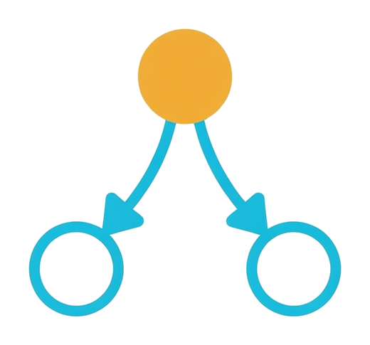

<a id="readme-top"></a>

[![Contributors][contributors-shield]][contributors-url]
[![Forks][forks-shield]][forks-url]
[![Stargazers][stars-shield]][stars-url]
[![Issues][issues-shield]][issues-url]

<div align="center">
  <a href="https://github.com/xnoname79/unity-agent-orchestrator">
    
  </a>

  <h3 align="center">Agent Orchestrator</h3>

  <p align="center">
    Claude Code, Codex and Antigravity CLI, working together on one canvas.
    <br />
    <a href="#usage"><strong>Explore the docs »</strong></a>
    <br />
    <br />
    <a href="../../releases">Download</a>
    &middot;
    <a href="../../issues/new">Report Bug</a>
    &middot;
    <a href="../../issues/new">Request Feature</a>
  </p>
</div>

<details>
  <summary>Table of Contents</summary>
  <ol>
    <li>
      <a href="#about-the-project">About The Project</a>
      <ul><li><a href="#built-with">Built With</a></li></ul>
    </li>
    <li><a href="#screenshots">Screenshots</a></li>
    <li>
      <a href="#getting-started">Getting Started</a>
      <ul>
        <li><a href="#prerequisites">Prerequisites</a></li>
        <li><a href="#installation">Installation</a></li>
      </ul>
    </li>
    <li>
      <a href="#usage">Usage</a>
      <ul>
        <li><a href="#spawn-an-agent">Spawn an agent</a></li>
        <li><a href="#self-filling-playbooks">Self-filling playbooks</a></li>
        <li><a href="#openai-compatible-api">OpenAI-compatible API</a></li>
        <li><a href="#command-line">Command line</a></li>
      </ul>
    </li>
    <li><a href="#configuration">Configuration</a></li>
    <li><a href="#safety">Safety</a></li>
    <li><a href="#contributing">Contributing</a></li>
    <li><a href="#license">License</a></li>
    <li><a href="#contact">Contact</a></li>
  </ol>
</details>

## About The Project

[![Product screenshot][product-screenshot]](images/screenshot-canvas.png)

A harness that puts **agents from different providers on one canvas** and lets them work
together. Claude Code, Codex CLI and Antigravity (Gemini) sessions run side by side, signal each
other, hand off work, and stream their output into a single web UI.

It does not reimplement an agent. It drives the CLIs you already have installed and logged in,
so each provider keeps its own subscription, its own auth, and its own tools.

* **One canvas, many agents.** Every card is a live terminal you can type into. Drag and resize
  them; arrows animate between cards as signals flow.
* **Agents talk to each other, in parallel.** `send_signal(to_role="...")` resolves the role,
  injects the message, and records the run. Different projects run concurrently; two messages to
  the *same* agent queue behind a lock so transcripts never interleave.
* **Two workspaces at once.** Every workspace is a tab; open two and split the window between
  them, browser-style, picking which one goes in each pane. Both canvases stay live.
* **Cards hold the terminal, panels hold the actions.** A card is the agent's terminal plus the
  few controls you reach for while typing; select it and the rest — model, effort, skill, context
  — opens on the right. Ten agents, not ninety buttons.
* **OpenAI-compatible API.** Point any OpenAI client at `/v1` and chat with an agent as if it
  were a model. Streaming included.
* **Dark mode**, a minimap once the canvas outgrows the window, and a single binary with no
  Python install required.

<p align="right">(<a href="#readme-top">back to top</a>)</p>

### Built With

[![Python][python-shield]][python-url]
[![Starlette][starlette-shield]][starlette-url]
[![SQLite][sqlite-shield]][sqlite-url]
[![xterm.js][xterm-shield]][xterm-url]

<p align="right">(<a href="#readme-top">back to top</a>)</p>

## Screenshots

| | |
|---|---|
| ![Two workspaces side by side][screenshot-split] | ![Node inspector][screenshot-inspector] |
| Two workspaces, side by side | A selected agent and its inspector |
| ![Embedded terminal][screenshot-terminal] | ![History][screenshot-history] |
| A live CLI inside a card | Signal queue and audit log |

<p align="right">(<a href="#readme-top">back to top</a>)</p>

## Getting Started

### Prerequisites

Install and log in to at least one provider CLI first — the orchestrator drives them, it does
not replace them.

| | Install |
|---|---|
| **Claude Code** | [code.claude.com/docs/en/quickstart](https://code.claude.com/docs/en/quickstart#native-install-recommended) |
| **Codex CLI** | [learn.chatgpt.com/docs/codex/cli](https://learn.chatgpt.com/docs/codex/cli#getting-started) |
| **Antigravity CLI** | [antigravity.google/docs/cli](https://antigravity.google/docs/cli/reference) — the `agy` command, for Google models |
| **Python 3.10+** | Only if you run from source |
| **neovim** + **tmux** | Optional — only for the editor card |
| **diffview.nvim** | Optional — adds the card's **git** tab |

> The editor card runs `nvim` inside a tmux session, so closing the browser tab detaches instead
> of discarding your buffer. Without tmux the card still works, but the nvim process ends with the
> tab. Without `nvim` there is simply no editor card; everything else is unaffected.
>
> The card's **git** tab runs `:DiffviewOpen`, so it needs
> [diffview.nvim](https://github.com/sindrets/diffview.nvim) in your neovim config — a
> side-by-side diff of the working tree, the index, or any revision, inside the same nvim. It is
> a plugin, not a program, so there is nothing extra to put on PATH; without it the tab just
> reports an unknown command.
>
> Override the binaries with `ORCH_NVIM_BIN` / `ORCH_TMUX_BIN`.

> The orchestrator finds the CLIs through the **PATH of its own process**. Install one while it
> is running and you have to restart it. If `where.exe claude` / `which claude` prints a path but
> the dashboard still says the command was not found, set `CLAUDE_BIN` / `ORCH_CODEX_BIN` /
> `ORCH_AGY_BIN` — see
> [Configuration](#configuration).

### Installation

**Prebuilt binary** — no Python needed. Grab it from [Releases](../../releases).

```bash
chmod +x agent-orch-linux-x64
./agent-orch-linux-x64            # no argument = serve
```

On Windows, unzip `agent-orch-windows-x64.zip` and double-click `agent-orch.exe` inside the
folder. Keep the folder together — the `_internal` directory beside the `.exe` is the program,
and the `.exe` will not start on its own. The console window that opens *is* the server; closing
it stops the orchestrator.

> [!NOTE]
> These builds are not code-signed, so Windows SmartScreen has no reputation for them and may
> offer to **delete** the download. Verify the hash against `SHA256SUMS.txt`, then clear the
> download mark — do this on the `.zip`, *before* extracting, since every file inside inherits
> the mark:
>
> ```powershell
> Get-FileHash agent-orch-windows-x64.zip -Algorithm SHA256
> Unblock-File agent-orch-windows-x64.zip
> ```
>
> If Defender quarantines it outright, that is a false positive on the PyInstaller bundle — it
> can be reported at [Microsoft's submission portal](https://www.microsoft.com/en-us/wdsi/filesubmission).
> Do not disable Defender or add an exclusion for it; the next release is a different file and
> the exclusion will not cover it.

**From source:**

```bash
pip install -r requirements.txt
python3 session_orchestrator.py serve
```

Then open:

| URL | What |
|---|---|
| `http://localhost:8992/` | Canvas dashboard |
| `http://localhost:8992/docs` | API documentation (Swagger UI) |

Databases are created on first run under `~/.session_orch_db/`.

**Register the signal MCP — once per CLI.** This is what lets agents reach each other; every
session afterwards picks it up automatically.

```bash
claude mcp add --transport http --scope user signal http://127.0.0.1:8992/signal/mcp
codex mcp add signal --url http://127.0.0.1:8992/signal/mcp
agy mcp add signal http://127.0.0.1:8992/signal/mcp
```

The signal server runs **in-process** with the orchestrator — no second service, no extra port.

### MCP servers panel

The 🔌 button in the topbar registers any HTTP MCP server for **every** claude session on the
machine — the same user-scope entry `claude mcp add` writes, into the same `~/.claude.json`.
It lists what is already registered, checks each one, and removes them.

Two things it does that the CLI does not:

- **The token never reaches a command line.** `claude mcp add` only accepts a header through
  `--header`, so the bearer token ends up in `argv` — readable by `ps`, kept in shell history.
  The panel writes the entry directly instead. Saved tokens are never handed back out; the API
  answers with the last four characters.
- **It proves the server works before saving.** Add calls `tools/list` first; a server that
  refuses the token or does not answer leaves your config **byte-identical**. "Saved" is not a
  status anyone can act on, so the panel reports the tool count the server actually returned.

Servers registered as stdio are listed but not probed — there is no URL to call.

| Env | Default | |
|---|---|---|
| `ORCH_CLAUDE_CONFIG` | `~/.claude.json` | the config file that gets written |
| `ORCH_MCP_TIMEOUT` | `6` | seconds to wait for `tools/list` |

Guard: `python3 check_mcp.py`.

<p align="right">(<a href="#readme-top">back to top</a>)</p>

## Usage

### Spawn an agent

Use **Spawn agent** on the dashboard. Four fields matter:

* **Role name** — the agent's identity. Signals are routed by it, so it must be unique in the
  workspace. It also names the skill directory the playbook is written to.
* **Playbook template** — which bundled template under `.claude/skills/` seeds the role. Several
  agents can share one; they differ by role name, not by playbook source.
* **Working dir** — the project the agent operates in.
* **Model** — a tab per provider:

  | Tab | Values | Runs on |
  |---|---|---|
  | Claude | `opus`, `sonnet`, `haiku`, `claude-opus-4-8`, … | Claude Code CLI |
  | Codex | `codex` (auto), `codex:gpt-5.6-terra`, `codex:gpt-5.6-luna`, … | Codex CLI |
  | Gemini | `agy` (auto), `agy:gemini-3.1-pro-high`, `agy:gemini-3.8-flash-low`, … | Antigravity CLI |

  The `codex:` and `agy:` prefixes are required — slugs like `gpt-5.6-terra` are also valid
  OpenAI API model names, and `agy models` even lists `claude-*` ones, so without a prefix there
  is no way to tell which CLI you meant.

Reasoning effort uses one ladder across providers, clamped per model rather than failing:
Claude tops out at `max`, `codex:gpt-5.6-terra` at `ultra`, `codex:gpt-5.6-luna` at `max`, the
rest at `xhigh`. Antigravity slugs carry their own level (`…-pro-high`, `…-flash-low`), so for
those the model *is* the setting and no separate effort flag is sent.

### Self-filling playbooks

A template leaves its project-specific parts blank as `<UPPERCASE>` placeholders. When a spawned
agent's `SKILL.md` still contains one, the orchestrator queues a single bootstrap run asking that
agent to survey its working directory and fill the blanks in itself.

The placeholders **are** the one-time flag: once gone, the bootstrap never fires again, so
nothing overwrites a playbook you or the agent has since edited. The result is written to
`.claude/skills/`, `.codex/skills/` and `.agents/skills/`, since each CLI only reads its own.

Peer routing is deliberately *not* baked into playbooks — the roster changes as agents come and
go, so every signal carries a reminder to call `list_agents` instead of trusting a remembered
role name.

### OpenAI-compatible API

```python
from openai import OpenAI

client = OpenAI(base_url="http://localhost:8992/v1", api_key="<ORCH_API_KEY>")

stream = client.chat.completions.create(
    model="<workspace_id>/<agent_alias>",          # e.g. "ws_3b99a7/backend"
    messages=[{"role": "user", "content": "Summarise today's changes"}],
    stream=True,
)
for chunk in stream:
    print(chunk.choices[0].delta.content or "", end="", flush=True)
```

Two ways it differs from OpenAI:

* **It is stateful.** The conversation lives in the CLI's own transcript on the server, so only
  the part **new since the last `assistant` message** is sent to the agent. Resending history
  would duplicate context, not restore it.
* **One request is one real agent run.** It goes through the session lock, the daily cap and the
  audit log. A single turn can take minutes (`ORCH_CHAT_TIMEOUT`, default 900s).

### Command line

```bash
python3 session_orchestrator.py init            # create the database
python3 session_orchestrator.py serve           # dashboard + API + MCP
python3 session_orchestrator.py once            # process pending signals once
python3 session_orchestrator.py loop            # polling daemon, no web server
python3 session_orchestrator.py list-sessions   # also: list-signals, list-runs
```

<p align="right">(<a href="#readme-top">back to top</a>)</p>

## Configuration

| Variable | Default | Purpose |
|---|---|---|
| `ORCH_PORT` / `ORCH_HOST` | `8992` / `0.0.0.0` | Where to listen |
| `ORCH_API_KEY` | *(unset)* | Require a key on `/api/*` and `/v1/*` |
| `ORCH_CORS_ORIGINS` | `*` | Allowed browser origins; empty disables CORS |
| `CLAUDE_BIN` / `ORCH_CODEX_BIN` / `ORCH_AGY_BIN` | `claude` / `codex` / `agy` | Paths to the provider CLIs |
| `ORCH_AGY_HOME` | `~/.gemini/antigravity-cli` | Where the Antigravity CLI keeps its conversations |
| `ORCH_DEFAULT_EFFORT` | `high` | Reasoning effort when a session sets none |
| `ORCH_MAX_CONCURRENT` | `3` | Agent runs in flight at once |
| `ORCH_CHAT_TIMEOUT` | `900` | Seconds one `/v1` turn may take |
| `ORCH_DRY_RUN` | `0` | Simulate runs without calling any CLI |

Values can also live in a `.env` file placed **next to the executable** — on Windows that means
inside the unzipped folder, beside `agent-orch.exe`. Full list in the header of
[session_orchestrator.py](session_orchestrator.py).

**Windows:** the embedded terminal runs on ConPTY and needs Windows 10 1809 or newer. The
prebuilt build bundles it; from source, `pip install pywinpty`. `GET /health` reports
`embedded_terminal`, and `embedded_terminal_reason` when it is unavailable.

<p align="right">(<a href="#readme-top">back to top</a>)</p>

## Safety

> [!WARNING]
> `ORCH_CORS_ORIGINS` defaults to `*` and there is no API key unless you set one. Agents here run
> shell commands with permissions bypassed, so that combination lets **any website you visit**
> drive them. Set `ORCH_API_KEY`, or narrow `ORCH_CORS_ORIGINS`, before exposing the port.

Built to run many agents unattended without runaway loops:

* **Approval gate** — signals marked `requires_approval` wait for a human on the dashboard.
* **Ping-pong cap** — a pair of agents gets a bounded number of exchanges per task; the budget
  reopens when a human gives new work.
* **Daily cap** — `ORCH_MAX_RUNS_PER_DAY` blocks a session until you press **Allow +N**.
* **Kill switch** — global and per-workspace, from the dashboard.
* **Per-session lock** — one prompt in flight per session, so transcripts never mix.
* **Audit log** — every injection recorded with status, token count and the full event stream.
* **Workspaces** — each tenant gets an isolated folder; every session's `cwd` is pinned inside
  it, and signals never cross a workspace boundary.

**Codex sandbox.** Measured on Codex CLI 0.147.0: in headless `codex exec`, MCP tool calls only
run under `--dangerously-bypass-approvals-and-sandbox`. Every other combination returns *"user
cancelled MCP tool call"* — so a sandboxed Codex agent **cannot signal**. The orchestrator maps
`permission_mode` directly and prints a warning to the timeline when signalling is off, rather
than letting the hand-off fail silently.

**Antigravity permissions.** Measured on agy 1.1.26: headless `agy -p` has no one to ask, so any
tool needing permission is auto-denied — including `call_mcp_tool`, and therefore signalling —
while the run still reports success with an empty answer. The orchestrator passes
`--dangerously-skip-permissions` when a session's `permission_mode` is `bypassPermissions` (the
default), warns on the timeline when it is not, and surfaces the `denied_actions` agy reports.

The sandbox restricts **writes and network, not reads**. Directory boundaries between agents are
a convention in their prompts, not a kernel-enforced wall.

<p align="right">(<a href="#readme-top">back to top</a>)</p>

## Contributing

Issues and pull requests are welcome.

1. Fork the project
2. Create your branch (`git checkout -b feat/amazing-feature`)
3. Commit your changes (`git commit -m 'feat: add amazing feature'`)
4. Push and open a pull request

The dashboard is vanilla JS with no build step. Before opening a PR that touches it, run:

```bash
python3 static/orchestrator/check_ui.py
```

It catches what breaks silently in a UI wired by string ids: a `$("id")` with no element, an
`onclick` calling a function that was never exported, a missing icon, a colour hardcoded outside
the theme tokens. CI runs it too.

<p align="right">(<a href="#readme-top">back to top</a>)</p>

## License

No licence has been chosen yet, so default copyright applies — the source is public to read, but
not yet to reuse. A `LICENSE` file will settle this.

<p align="right">(<a href="#readme-top">back to top</a>)</p>

## Contact

Project link: [xnoname79/unity-agent-orchestrator](https://github.com/xnoname79/unity-agent-orchestrator) ·
[open an issue](../../issues)

<p align="right">(<a href="#readme-top">back to top</a>)</p>

[contributors-shield]: https://img.shields.io/github/contributors/xnoname79/unity-agent-orchestrator.svg?style=for-the-badge
[contributors-url]: https://github.com/xnoname79/unity-agent-orchestrator/graphs/contributors
[forks-shield]: https://img.shields.io/github/forks/xnoname79/unity-agent-orchestrator.svg?style=for-the-badge
[forks-url]: https://github.com/xnoname79/unity-agent-orchestrator/network/members
[stars-shield]: https://img.shields.io/github/stars/xnoname79/unity-agent-orchestrator.svg?style=for-the-badge
[stars-url]: https://github.com/xnoname79/unity-agent-orchestrator/stargazers
[issues-shield]: https://img.shields.io/github/issues/xnoname79/unity-agent-orchestrator.svg?style=for-the-badge
[issues-url]: https://github.com/xnoname79/unity-agent-orchestrator/issues

[python-shield]: https://img.shields.io/badge/Python-3670A0?style=for-the-badge&logo=python&logoColor=ffdd54
[python-url]: https://www.python.org/
[starlette-shield]: https://img.shields.io/badge/Starlette-1f2937?style=for-the-badge
[starlette-url]: https://www.starlette.io/
[sqlite-shield]: https://img.shields.io/badge/SQLite-07405e?style=for-the-badge&logo=sqlite&logoColor=white
[sqlite-url]: https://www.sqlite.org/
[xterm-shield]: https://img.shields.io/badge/xterm.js-0c0e12?style=for-the-badge
[xterm-url]: https://xtermjs.org/

[product-screenshot]: images/screenshot-canvas.png
[screenshot-split]: images/screenshot-split.png
[screenshot-inspector]: images/screenshot-inspector.png
[screenshot-terminal]: images/screenshot-terminal.png
[screenshot-history]: images/screenshot-history.png
