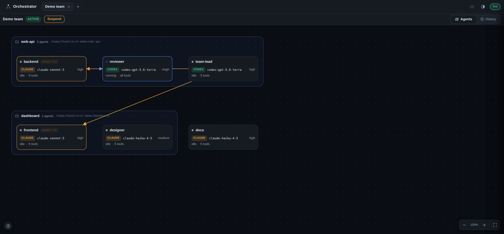
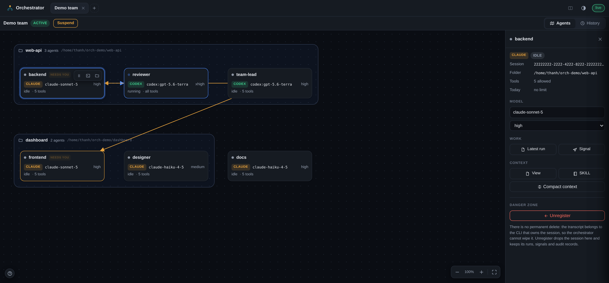
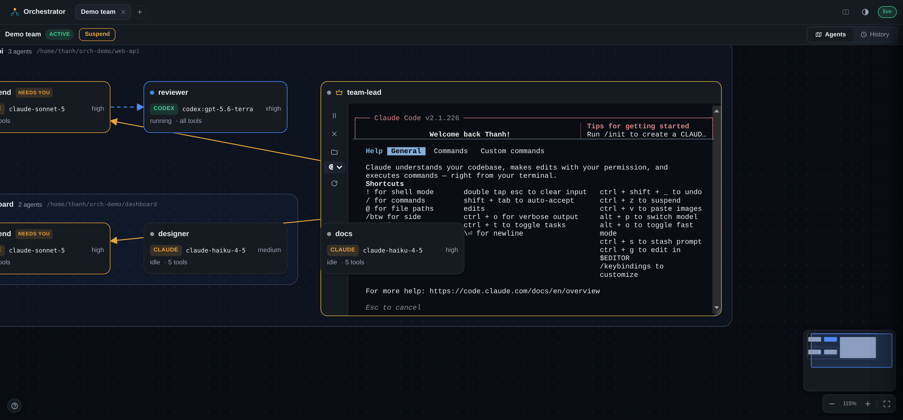
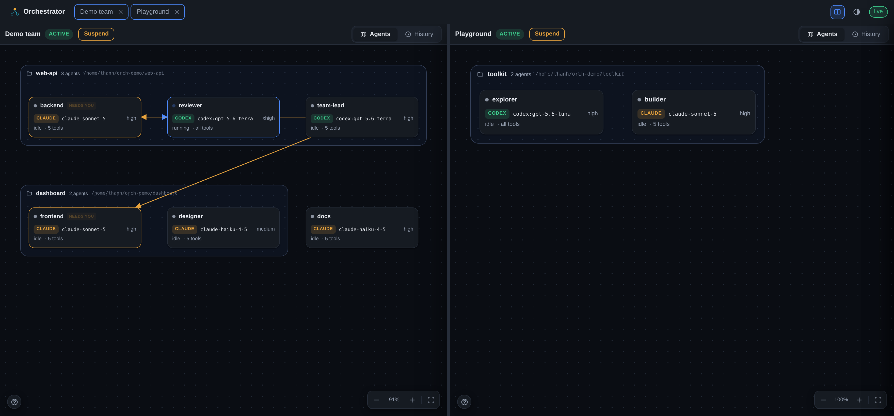
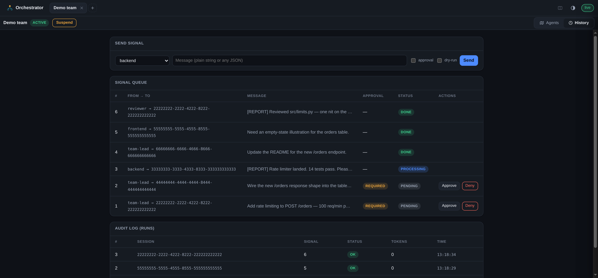

# Agent Orchestrator

Claude Code, Codex and Antigravity CLI on one canvas, signalling each other.



Each card is a live terminal you can type into. Agents pass work to each other with
`send_signal`, every run is queued and logged, and you watch it happen. The orchestrator drives
the CLIs already installed on your machine, so each provider keeps its own subscription and
login.

[Download](../../releases) · [Report a bug](../../issues/new)

## Requirements

At least one provider CLI, installed and logged in:

| CLI | Install |
|---|---|
| Claude Code | [code.claude.com/docs](https://code.claude.com/docs/en/quickstart#native-install-recommended) |
| Codex CLI | [learn.chatgpt.com/docs/codex/cli](https://learn.chatgpt.com/docs/codex/cli#getting-started) |
| Antigravity CLI | [antigravity.google/docs/cli](https://antigravity.google/docs/cli/reference) — the `agy` command |

The orchestrator finds them through the PATH of its own process. Install one while it is running
and you have to restart it. If `which claude` prints a path but the dashboard still says the
command is missing, set `CLAUDE_BIN` / `ORCH_CODEX_BIN` / `ORCH_AGY_BIN`.

## Install

**Windows.** Download `agent-orch-windows-x64.zip` from [Releases](../../releases), unzip it, run
`agent-orch.exe` from inside the folder. Keep the folder together: the `_internal` directory next
to the `.exe` is the program. The console window that opens is the server — close it to stop.

<details>
<summary>SmartScreen may offer to <b>delete</b> the download</summary>

These builds are not code-signed, so SmartScreen has no reputation for them. Check the hash
against `SHA256SUMS.txt`, then clear the download mark. Do it on the `.zip`, before extracting —
every file inside inherits the mark.

```powershell
Get-FileHash agent-orch-windows-x64.zip -Algorithm SHA256
Unblock-File agent-orch-windows-x64.zip
```

If Defender quarantines it outright, that is a false positive on the PyInstaller bundle; report it
at [Microsoft's submission portal](https://www.microsoft.com/en-us/wdsi/filesubmission). Do not
add an exclusion — the next release is a different file and the exclusion will not cover it.
</details>

**macOS, Linux, or to work on the code.** Python 3.10+, no build step for the frontend:

```bash
git clone https://github.com/xnoname79/unity-agent-orchestrator.git
cd unity-agent-orchestrator
python3 -m venv .venv && source .venv/bin/activate     # Windows: .venv\Scripts\activate
pip install -r requirements.txt
python3 session_orchestrator.py serve
```

Open <http://localhost:8992>. The API docs are at `/docs`. The database is created on first run
under `~/.session_orch_db/`; there is no migration step. Change the port with `ORCH_PORT`.

## Let the agents reach each other

Once per CLI. Every session afterwards picks it up:

```bash
claude mcp add --transport http --scope user signal http://127.0.0.1:8992/signal/mcp
codex mcp add signal --url http://127.0.0.1:8992/signal/mcp
agy mcp add signal http://127.0.0.1:8992/signal/mcp
```

The signal server runs in-process — no second service, no extra port.

### Other MCP servers

The 🔌 button in the topbar adds any HTTP MCP server to every CLI installed here in one go, which
matters because none of them reads another's config: codex reads `~/.codex/config.toml`, agy reads
`~/.gemini/config/mcp_config.json`, claude reads `~/.claude.json`. A server added for one engine
is a tool that silently does not exist for the other two, so each row tags the CLIs that really
have it.

It also calls `tools/list` before saving — a server that refuses the token leaves every config
byte-identical, and the panel reports the tool count it got back. And the bearer token never
reaches a command line: all three CLIs take headers only through a flag, where `ps` and your shell
history can read them, so the panel writes the config entry directly. Saved tokens are never handed
back out; the API answers with the last four characters.

| Env | Default | |
|---|---|---|
| `ORCH_CLAUDE_CONFIG` | `~/.claude.json` | claude's config file |
| `ORCH_CODEX_CONFIG` | `$CODEX_HOME/config.toml` | codex's config file |
| `ORCH_AGY_MCP_CONFIG` | `~/.gemini/config/mcp_config.json` | agy's MCP config file |
| `ORCH_MCP_TIMEOUT` | `6` | seconds to wait for `tools/list` |

## Spawn an agent



**Spawn agent** asks for the group first, then a workspace inside it, then four fields:

* **Role name** — how signals find this agent, so it must be unique in the workspace. It also
  names the skill directory its playbook is written to.
* **Playbook template** — which bundled template under `.claude/skills/` seeds the role. Several
  agents can share one; they differ by role name, not by playbook.
* **Working dir** — the project the agent operates in. Leave it empty to use the workspace folder.
* **Model** — one tab per provider:

  | Tab | Values | Runs on |
  |---|---|---|
  | Claude | `opus`, `sonnet`, `haiku`, `claude-opus-4-8`, … | Claude Code CLI |
  | Codex | `codex` (auto), `codex:gpt-5.6-terra`, … | Codex CLI |
  | Gemini | `agy` (auto), `agy:gemini-3.1-pro-high`, … | Antigravity CLI |

The `codex:` and `agy:` prefixes are required. Slugs like `gpt-5.6-terra` are also valid OpenAI
API model names and `agy models` even lists `claude-*` ones, so without a prefix there is no way
to tell which CLI you meant.

Reasoning effort is one ladder across providers, clamped per model instead of failing: Claude tops
out at `max`, `codex:gpt-5.6-terra` at `ultra`, the rest at `xhigh`. Antigravity slugs carry their
own level (`…-pro-high`), so there the model is the setting.



### Playbooks fill themselves in

A template leaves its project-specific parts blank as `<UPPERCASE>` placeholders. A spawned agent
whose `SKILL.md` still has one gets a single bootstrap run: survey the working directory, fill the
blanks in. The placeholders are the flag — once gone the bootstrap never fires again, so nothing
overwrites a playbook you or the agent has edited since.

The result is written to `.claude/skills/`, `.codex/skills/` and `.agents/skills/`, because each
CLI reads only its own. A card spawned before a CLI existed shows a 🕮 button that copies the
playbook into whichever roots are missing it.

## Workspaces and groups



A **workspace** is the isolation boundary: its own folder, its own agents, and signals that never
leave it. A **group** is a drawer you file workspaces into — *work*, *hobby*, one per client — so
Home stays readable once you have a dozen. Renaming a group renames a label; deleting one re-files
its workspaces under the default group and removes nothing else.

Open two workspaces at once and the window splits, browser-style, with a live canvas in each pane.

Nothing below the dashboard knows groups exist. Routing, budgets and isolation resolve by
workspace, so moving a workspace between groups cannot change who can signal whom.

The workspace named `default` is not one of yours: it holds anything the API receives without a
`workspace_id`. The dashboard hides it while it is empty, and shows it again the moment an agent
lands in it — a hidden workspace with agents inside would be one you cannot reach.

## Browse a project

The 📁 button on a card opens a folder card clipped to the right edge of that agent's terminal,
the two framed as one block. Click a folder to go in, the breadcrumb to come back, a file to read
it; text shows as text, images as images. Drag either half and both move. It needs nothing
installed and works the same over the network.

Reads are locked inside the agent's project folder. Hidden entries (`.git`, `.env`) are not
listed, files are served read-only, and `..`, absolute paths and symlinks pointing out of the tree
are refused.

The ⧉ button opens the same folder in your own file manager — Finder, File Explorer, Nautilus —
for what a browser cannot do, like dragging a file out. That one needs the orchestrator to be
running on the machine you are sitting at; a headless install says so instead of doing nothing.

### Developer mode

Start with `--dev` (or `ORCH_DEV_MODE=1`) and 📁 opens neovim in a tmux-wrapped terminal card
instead, with a **git** tab showing [diffview.nvim](https://github.com/sindrets/diffview.nvim)
over the working tree.

```bash
python3 session_orchestrator.py --dev serve
```

That one does need neovim and tmux on the machine running the orchestrator; point
`ORCH_NVIM_BIN` / `ORCH_TMUX_BIN` at them if they are not on PATH.

The mode is picked at startup; there is no switch in the UI. Editor cards live in tmux and outlive
the orchestrator, so one opened in developer mode is still there after a plain restart — the flag
only decides what the button opens next.

## Make images

The picture button in the top bar opens **Images**. Describe what you want, pick a shape, press
**Generate**, and the image lands in the gallery below, usually in under a minute. Click one to
open it full size and save it from there.

- **Shape** — square, landscape (4:3, 3:2), wide 16:9, portrait (3:4, 2:3) or tall 9:16.
- **Description** — leave it on *My words, exactly*, or let a Gemini model rewrite your text into
  a fuller prompt first. Hover a picture to see the prompt it was drawn from.
- **Reference images** — up to three. Press **Reference** on a picture in the gallery, or
  **Add image…** for your own (PNG, JPEG or WebP, up to 10 MB). The new image edits, combines or
  follows them: keep a character across scenes, or change one thing in a picture.

It draws with the image tool built into the Antigravity CLI, so it runs on the Google account
`agy` is signed in with: no API key, and it counts against that account's quota. Google decides
which model draws; the one you pick only writes the prompt. `agy` must be installed and signed in.

Images are kept in `~/.session_orch_db/images/`, each beside a `.json` with its prompt.

## Talk to an agent over the OpenAI API

```python
from openai import OpenAI

client = OpenAI(base_url="http://localhost:8992/v1", api_key="<ORCH_API_KEY>")

stream = client.chat.completions.create(
    model="<workspace_id>/<agent_alias>",          # e.g. "ws_3b99a7/backend"
    messages=[{"role": "user", "content": "Summarise today's changes"}],
    stream=True,
)
for chunk in stream:
    print(chunk.choices[0].delta.content or "", end="", flush=True)
```

It is stateful: the conversation lives in the CLI's own transcript on the server, so only the part
new since the last `assistant` message is sent on. Resending history duplicates context rather
than restoring it. One request is one real agent run — through the session lock, the daily cap and
the audit log — and a single turn can take minutes (`ORCH_CHAT_TIMEOUT`, default 900s).

## Command line

```bash
python3 session_orchestrator.py init            # create the database
python3 session_orchestrator.py serve           # dashboard + API + MCP
python3 session_orchestrator.py --dev serve     # …with the nvim editor card
python3 session_orchestrator.py once            # process pending signals once
python3 session_orchestrator.py loop            # polling daemon, no web server
python3 session_orchestrator.py list-sessions   # also: list-signals, list-runs
```

## Configuration

| Variable | Default | Purpose |
|---|---|---|
| `ORCH_PORT` / `ORCH_HOST` | `8992` / `0.0.0.0` | Where to listen |
| `ORCH_API_KEY` | *(unset)* | Require a key on `/api/*` and `/v1/*` |
| `ORCH_CORS_ORIGINS` | `*` | Allowed browser origins; empty disables CORS |
| `CLAUDE_BIN` / `ORCH_CODEX_BIN` / `ORCH_AGY_BIN` | `claude` / `codex` / `agy` | Paths to the provider CLIs |
| `ORCH_AGY_HOME` | `~/.gemini/antigravity-cli` | Where the Antigravity CLI keeps its conversations |
| `ORCH_DEFAULT_EFFORT` | `high` | Reasoning effort when a session sets none |
| `ORCH_MAX_CONCURRENT` | `3` | Agent runs in flight at once |
| `ORCH_MAX_RUNS_PER_DAY` | `0` | Daily run cap per session; `0` is no cap |
| `ORCH_CHAT_TIMEOUT` | `900` | Seconds one `/v1` turn may take |
| `ORCH_DRY_RUN` | `0` | Simulate runs without calling any CLI |
| `ORCH_DEV_MODE` | `0` | 📁 opens an nvim card instead of the folder card (same as `--dev`) |

These can live in a `.env` file next to the executable — on Windows, inside the unzipped folder
beside `agent-orch.exe`. The full list is in the header of
[session_orchestrator.py](session_orchestrator.py).

The embedded terminal runs on ConPTY on Windows and needs Windows 10 1809 or newer. The prebuilt
build bundles it; from source, `pip install pywinpty`. `GET /health` reports `embedded_terminal`,
and `embedded_terminal_reason` when it is unavailable.

## Keep it running

Run it as your own user, never root — the provider CLIs read their logins from your home
directory. Replace the paths with wherever you unzipped or cloned it.

<details>
<summary>Windows — Task Scheduler</summary>

```powershell
$exe = "$HOME\agent-orch-windows-x64\agent-orch.exe"
Register-ScheduledTask -TaskName "AgentOrchestrator" `
  -Action  (New-ScheduledTaskAction -Execute $exe -WorkingDirectory (Split-Path $exe)) `
  -Trigger (New-ScheduledTaskTrigger -AtLogOn) `
  -Settings (New-ScheduledTaskSettingsSet -StartWhenAvailable `
               -RestartCount 3 -RestartInterval (New-TimeSpan -Minutes 1))
```

Remove it with `Unregister-ScheduledTask -TaskName "AgentOrchestrator"`.
</details>

<details>
<summary>Linux — systemd user service</summary>

```bash
mkdir -p ~/.config/systemd/user
cat > ~/.config/systemd/user/orchestrator.service <<'UNIT'
[Unit]
Description=Agent Orchestrator (dashboard + MCP, port 8992)
After=network-online.target
Wants=network-online.target

[Service]
Type=simple
WorkingDirectory=%h/unity-agent-orchestrator
ExecStart=%h/unity-agent-orchestrator/.venv/bin/python %h/unity-agent-orchestrator/session_orchestrator.py serve
Environment=PYTHONUNBUFFERED=1
Restart=on-failure
RestartSec=3
TimeoutStopSec=15

[Install]
WantedBy=default.target
UNIT

systemctl --user daemon-reload
systemctl --user enable --now orchestrator
loginctl enable-linger "$USER"     # start at boot, not only when you log in
```

Then `systemctl --user restart orchestrator` after a pull, and
`journalctl --user -u orchestrator -f` for the log. `Environment=` lines in the unit win over the
`.env` file — that is where to put `ORCH_DEV_MODE=1`.
</details>

<details>
<summary>macOS — launchd</summary>

```bash
cat > ~/Library/LaunchAgents/com.agent-orch.plist <<PLIST
<?xml version="1.0" encoding="UTF-8"?>
<!DOCTYPE plist PUBLIC "-//Apple//DTD PLIST 1.0//EN" "http://www.apple.com/DTDs/PropertyList-1.0.dtd">
<plist version="1.0"><dict>
  <key>Label</key><string>com.agent-orch</string>
  <key>ProgramArguments</key><array>
    <string>$HOME/unity-agent-orchestrator/.venv/bin/python</string>
    <string>$HOME/unity-agent-orchestrator/session_orchestrator.py</string>
    <string>serve</string>
  </array>
  <key>WorkingDirectory</key><string>$HOME/unity-agent-orchestrator</string>
  <key>RunAtLoad</key><true/>
  <key>KeepAlive</key><true/>
  <key>StandardOutPath</key><string>$HOME/Library/Logs/agent-orch.log</string>
  <key>StandardErrorPath</key><string>$HOME/Library/Logs/agent-orch.err</string>
</dict></plist>
PLIST

launchctl load -w ~/Library/LaunchAgents/com.agent-orch.plist
```

Stop it with `launchctl unload -w ~/Library/LaunchAgents/com.agent-orch.plist`.
</details>

> [!WARNING]
> Starting on boot means the port is open for as long as the machine is up. Read Safety first.

## Safety

> [!WARNING]
> `ORCH_CORS_ORIGINS` defaults to `*` and there is no API key unless you set one. Agents here run
> shell commands with permissions bypassed, so that combination lets **any website you visit**
> drive them. Set `ORCH_API_KEY`, or narrow `ORCH_CORS_ORIGINS`, before exposing the port.



What keeps a room full of unattended agents from running away:

* **Approval gate** — signals marked `requires_approval` wait for a human on the dashboard.
* **Ping-pong cap** — a pair of agents gets a bounded number of exchanges per task; the budget
  reopens when a human gives new work.
* **Daily cap** — off by default; set `ORCH_MAX_RUNS_PER_DAY` and a session that hits it waits
  until you press **Allow +N**.
* **Kill switch** — global and per workspace, from the dashboard.
* **Per-session lock** — one prompt in flight per session, so transcripts never mix.
* **Audit log** — every injection recorded with status, token count and the full event stream.

**Codex sandbox.** Measured on Codex CLI 0.147.0: in headless `codex exec`, MCP tool calls only
run under `--dangerously-bypass-approvals-and-sandbox`. Everything else returns *"user cancelled
MCP tool call"*, so a sandboxed Codex agent cannot signal. The orchestrator maps `permission_mode`
straight through and warns on the timeline when signalling is off, rather than letting the hand-off
fail silently.

**Antigravity permissions.** Measured on agy 1.1.26: headless `agy -p` has nobody to ask, so any
tool needing permission is auto-denied — `call_mcp_tool` included, and with it signalling — while
the run still reports success with an empty answer. The orchestrator passes
`--dangerously-skip-permissions` when a session's `permission_mode` is `bypassPermissions` (the
default), warns when it is not, and surfaces the `denied_actions` agy reports.

The sandbox restricts writes and network, not reads. Directory boundaries between agents are a
convention in their prompts, not a kernel-enforced wall.

## Contributing

Issues and pull requests welcome. The dashboard is vanilla JS wired by string ids, so a rename
breaks it silently — the page still loads and the button just stops working. Run the checks before
opening a PR; CI runs them too.

```bash
python3 static/orchestrator/check_ui.py     # dead ids, unexported onclick, stray colours
python3 check_editor.py                     # editor + folder cards, path confinement
python3 check_inject.py                     # a slash command reaches the CLI as a command
python3 check_mcp.py                        # no config write before the token is proven
python3 check_groups.py                     # the default workspace hides only while empty
python3 check_pair_cap.py                   # the ping-pong budget reopens on new work
python3 check_workspace_move.py             # a move cannot duplicate a role name
python3 check_shutdown.py                   # Ctrl-C returns, even with an SSE stream open
python3 check_images.py                     # drawings are picked up, references stay in the gallery
```

## License

No licence chosen yet, so default copyright applies: the source is public to read, not yet to
reuse. A `LICENSE` file will settle it.
